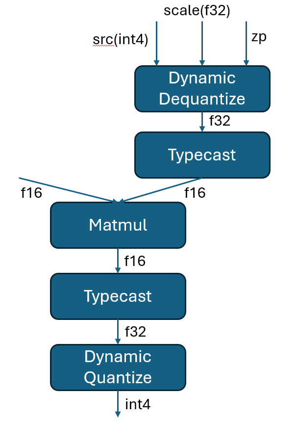

# Support int4 for compressed SDPA in oneDNN Graph

## Introduction

To reduce the memory footprint for generative inference of LLMs with cache
mechanism, oneDNN Graph need to support integral compression for K and V in
fused SDPA. To be more specific, in this RFC we are going to discuss supporting
int4 data types in Graph API. The following features will be required:

1. Add u4/s4 support.
2. Extend scales and zero points with groups.
3. Enhance fpmath mode setting.


## Features

### Add u4/s4 support

#### Data types

The proposal is to follow oneDNN primitive APIs design with adding int4 data
types enumerations in `dnnl_data_type_t` (defined in dnnl_common_types.h). The
new enumerations will work for both primitive and graph C APIs.

```cpp
/// Data type specification
typedef enum {
    /// Undefined data type, used for empty memory descriptors.
    dnnl_data_type_undef = 0,
    /// 16-bit/half-precision floating point.
    dnnl_f16 = 1,
    /// non-standard 16-bit (bfloat16 w/ 7 bit mantissa) floating point.
    dnnl_bf16 = 2,
    /// 32-bit/single-precision floating point.
    dnnl_f32 = 3,
    /// 32-bit signed integer.
    dnnl_s32 = 4,
    /// 8-bit signed integer.
    dnnl_s8 = 5,
    /// 8-bit unsigned integer.
    dnnl_u8 = 6,
    /// 64-bit/double-precision floating point.
    dnnl_f64 = 7,
    /// Boolean data type. Size is C++ implementation defined.
    dnnl_boolean = 8,
    /// [OFP8 standard 8-bit floating-point](https://www.opencompute.org/documents/ocp-8-bit-floating-point-specification-ofp8-revision-1-0-2023-06-20-pdf)
    /// with a 5-bit exponent and a 2-bit mantissa.
    dnnl_f8_e5m2 = 9,
    /// [OFP8 standard 8-bit floating-point](https://www.opencompute.org/documents/ocp-8-bit-floating-point-specification-ofp8-revision-1-0-2023-06-20-pdf)
    /// with a 4-bit exponent and a 3-bit mantissa.
    dnnl_f8_e4m3 = 10,
    /// 4-bit signed integer.
    dnnl_s4 = 11,
    /// 4-bit unsigned integer.
    dnnl_u4 = 12,

    /// Parameter to allow internal only data_types without undefined behavior.
    /// This parameter is chosen to be valid for so long as sizeof(int) >= 2.
    dnnl_data_type_max = 0x7fff,
} dnnl_data_type_t;
```

In Graph C++ API, the enum class `logical_tensor::data_type` (defined in
dnnl_graph.hpp) will be extended to support the int4 data types. 

The size of int4 data type will be 4bits.

```c++
class logical_tensor {
    // ...
    /// Data Types
    enum class data_type {
        undef = dnnl_data_type_undef,
        /// 16-bit/half-precision floating point.
        f16 = dnnl_f16,
        /// non-standard 16-bit (bfloat16 w/ 7 bit mantissa) floating point.
        bf16 = dnnl_bf16,
        /// 32-bit/single-precision floating point.
        f32 = dnnl_f32,
        /// 32-bit signed integer.
        s32 = dnnl_s32,
        /// 8-bit signed integer.
        s8 = dnnl_s8,
        /// 8-bit unsigned integer.
        u8 = dnnl_u8,
        /// Boolean data type. Size is C++ implementation defined.
        boolean = dnnl_boolean,
        /// 8-bit floating point data type with E5M2. Added by this RFC.
        f8_e5m2 = dnnl_f8_e5m2,
        /// 8-bit floating point data type with E4M3. Added by this RFC.
        f8_e4m3 = dnnl_f8_e4m3,
        /// 4-bit signed integer.
        s4 = dnnl_s4,
        /// 4-bit unsigned integer.
        u4 = dnnl_u4,
    };
    // ...
};
```

The new data types can be used to create logical tensors and tensors in oneDNN
Graph API.

```c++
using namespace dnnl::graph;

// create a s4 logical tensor with unknown ndim and dims.
auto lt1 = logical_tensor(id, logical_tensor::data_type::s4);

// create a u4 logical tensor with dims = (16, 8).
const logical_tensor::dims shape = {16, 8}
auto lt2 = logical_tensor(id, logical_tensor::data_type::u4, shape);
```

#### Operations

##### Option 1: Support int4 computation via patterns( Recommended )

The recommended proposal is that oneDNN Graph API will support int4 data type
through graph fusion following the way that int8 is supported, instead of
directly adding int4 datatype in computation operations. 

Since oneDNN Graph API needs to support the compressed SDPA with quantization in
runtime, the quantization in Graph API will be executed through
`DynamicDequantize` and `DynamicQuantize`.

For instance, an int4 matmul will be expressed with a subgraph
`DynamicDequantize(int4 -> f32) -> MatMul (f32) -> `
`DynamicQuantize (f32 -> int4)` and oneDNN Graph will fuse the subgraph into a
int4 Matmul partition and work on int4 data types for computation. In addition,
if int4 datatype is on weight only and it's expected that Matmul should work on
other floating-point datatypes, such as f16, a mixed precision pattern will be
required and the subgraph may look like:


The reasons behind this design are:

1. int4 data types has similar usage as int8 data types.
2. frameworks can reuse their int8 integration workflow for int4 datatypes.

In this case, `DynamicQuantize` and `DynamicDequantize` operations in oneDNN 
Graph opset will be exteneded to support the conversion between int4 and f32
data types:

1. `DynamicQuantize` will be extended to support int4 output, and scales and 
   zero points with groups. The library may raise an error if groups are not
   provided for a `DynamicQuantize` op for int4 weight compression.
2. `DynamicDequantize` will be extended to support int4 input, and scales and
   zero points with groups. The library may raise an error if groups are not
   provided for a `DynamicDequantize` op for int4 weight decompression.

Currently we do not plan to support int4 quantization with `Quantize` and
`Dequantize` operations and extend the support for grouped scale and zero
points. Other operations in the opset will keep unchanged and will not
support int4 data types directly.

##### Option 2: Define int4 operations

An alternative options is to support int4 computation by extending the exitsting
computation operations( e.g., Convolution, Matmul, etc. ) to make them accept
int4 data types inputs and/or generating int4 data types outputs.

This option is not recommended due to:

- It complicates the operation schemas. To support int4 computation, the
  operations will need to accept grouped scales and zero points.
- If there are multiple optionals inputs, for example, optional bias, optional
  activation scales, and optional weights scales, it will be hard to
  define them with the input list where the current inputs are defined based on
  positions.
- We can define new operations if we don't want to break the current operation
  semantics or simplify the operation schemas. But adding more operations for
  new data types will bloat the operation set quickly.
- It will be impossible for the frameworks to reuse the current int8 workflow
  and integration approaches.

#### Backend capacity

Based on option 1, the support methodology for int4 data types in backends is
similar to how int8 is supported as for now.

- If a `dequantize (int4 -> f32) -> op (f32) -> quantize (f32 -> int4)` fusion
  pattern is supported by a backend, the pattern will be returned to users as a
  fused partition which will work on int4 data type or higher precision data
  types for execution.
- If a `dequantize (int4 -> f32) -> op (f32) -> quantize (f32 -> int4)` fusion
  pattern is not supported by any backend, the pattern will be returned to users
  as 3 partitions and the op will work on f32 data type for execution. If any of
  the returned partitions is not supported by the library (e.g.,
  partition::is_supported() returns false), the partition needs to be handled by
  the users.
- For int4 and bf16/f16 mixed precision patterns, `TypeCast` operation is
  required. It's same as how int8 and bf16 mixed precision patterns are defined.

#### Training

Training support is not discussed here as the recipe and requirements from 
frameworks are not clear for it yet.

### Extend scales and zero points with groups

#### Background

According to the request from framework users, for compressing cached value with 
int4 data types, grouped scales are required for each hidden diemnsion. The 
requirement for grouped zero points is not promised.

Currently, for `DynamicDequantize` and `DynamicQuantize`, Graph API accepts a 
required f32 1D tensor as the scale factor, and an optional 1D tesnor as the 
zero points( can be either s8/u8/f32 ). What's more, two optional attributes are
 provided: `qtype` is used for specifying which quantization type is used, 
`per_tensor` or `per_channel`. And `axis` specifies on which dimension 
`per_channel` quantization will be applied. 

#### Proposals

##### Option 1: Extend dynamic quantization with new attibute( Recommended )

To extend current `DynamicDequantize` and `DynamicQuantize` for supporting
grouped scales and zero points with a new attribute,  the detailed work will
include:
1. Add `per_group` to the supported values of `qtype`, and the default value 
   will be unchanged.
2. Change the `axis` attribute value type to a vector of `s64` datatype, each
   element in the vector should be in the range of [-`r`, `r`-1] where 
   `r` = rank(`src`) and negative value means counting the dimension backwards
   from the end, which specifies one dimension on which the quantization will be
   applied. 
   1. For `per-tensor` quantization, the attribute will be ignored.
   2. For `per-channel` quantization, the vector should contain only 1 element,
      which is `1` by default.
   3. For `per-group` quantization, the size of the vector should be not larger
      than `r` and elements that refers to the same dimension are not allowed in
      the vector. The default value is `{1}`.
   If `per-group` quantization is not specified but more than one axis is given,
   the backend will report an error for the negative case.
3. Add one optional attribute `groups` to support `per-group` quantization.
   The value type of `groups` should be a vector of `s64` data type. The
   attribute is only required when `per_group` quantization type is specified.
   The size of the vector should be not larger than `g`, where
   `g` = rank(`axis`). For `i`th element, it indicates how many groups the
   `axis`[i] dimension will be divided into and it's required that:
   1. 1 <= `groups`[i] && `groups`[i] <= `axis`[i]
   2. `axis`[i] % `groups`[i] == 0 
   If `per-group` quantization is not specified and `groups` attribute is
   given, it will be ignored.

The usage will be like:

```cpp
std::vector<uint8_t> src {10, 20};
std::vector<int64_t> axis {0, 1};
std::vector<int64_t> groups {2, 1};

graph::op_t dync_dequantize(graph::op_kind::DynamicDequantize);
dync_dequantize.set_attr<std::string>(graph::op_attr::qtype, "per_group");
dync_dequantize.set_attr<std::vector<int64_t>>(graph::op_attr::axis, axis);
dync_dequantize.set_attr<std::vector<int64_t>>(graph::op_attr::groups, groups);
```

The option is recommended as we already supported `axis` attribute for
specifying the dimensions of quantization, hence adding a new attribute for
accepting the group num will have the least influence on current backend
implementation. In addition, the semantic will be clear and it's easier for
users to integrate.

##### Option 2: Extend quantization axis attribute

The second option is to extend existing `axis` attribute for `per-group` scale
and zero points. The detailed change will include:
1. Add `per_group` to the supported values of `qtype`, and the default value 
   will be unchanged.
2. Change the `axis` attribute value type to a unordered_map from int64 to int64
   datatype, where the key refers to the dimension to which the quantization
   will be applied to, and the value refer to the group num:
   1. For `per-tensor` quantization, the attribute will be ignored.
   2. For `per-channel` quantization, the unordered_map should contain only one
      key-value pair, and the value should be `1`.
   3. For `per-group` quantization, the size of the unordered_map should be not 
      larger than `r`. The keys should not repeat and for each key-value pair,
      the value should be not larger than key and key%value == 0.

The usage will be like:

```cpp
std::vector<uint8_t> src {10, 20};
std::unordered_map<int64_t, int64_t> axis {{0, 10}, {1, 1}};

graph::op_t dync_dequantize(graph::op_kind::DynamicDequantize);
dync_dequantize.set_attr<std::string>(graph::op_attr::qtype, "per_group");
dync_dequantize.set_attr<std::unordered_map<int64_t, int64_t>>
    (graph::op_attr::axis, axis);
```

This operation is not recommended due to the following reasons:
1. It's too complicated to cover both group axis and group num in one 
   attribute `axis`.
2. Compared with the vector, using unordered_map will introduce more complex 
   logic and exert more impact on current code. 
   

### Enhance fpmath mode setting

#### Background

With the request for comrpessed SDPA, int4/int8 storage along with f16/f16
computation will provide a good balance between size reduction, performance and
accurary. Currently, oneDNN infers the compute type by the weights type, hence
it's impossible for oneDNN to apply up-conversion for integral weights and
floating-points implicitly. 

In this case, setting floating-point explicitly is required. Take a `bf16u4bf16`
Matmul for example, it's requires setting bf16 floating-point math mode,
otherwise oneDNN might fail to create the primitive on CPU engine or execute
with reference kernel on GPU engine, leading to unsatisfying performance.

#### Limitation

Currently, oneDNN Graph API only supports graph-level attribute during the
construction of the graph object. However, according to the request from the 
framework user, it's expected that some operations which are sensitive to
precition will use f32 computation while other operations are set f16 precision.
In addition, the framework allows users to create models with arbitrary
precision combinations in `ACCURACY` execution mode, so the model will be 
computed as close as possible to the original definition, indicating that
different operations might use different compute precisions. Therefore, we
cannot use unified math mode for the whole graph.

Primitive API has supported enforcing implicit up-conversion on
weights for an integral primitive with setting the second argument
`dnnl_primitive_attr_set_fpmath_mode_v2`( C API ) or
`dnnl::primitive_attr::set_fpmath_mode`(C++ API) to `1` or `true`.

#### Proposals

Based on the request the current status of oneDNN Graph API, we proposed the
following options for support setting floating point math mode with a more
precise scope:

##### Option 1: Add partition-level API( Recommended )

The first option is to add a new partition-level API for setting fpmath-mode
for the partition. The parameters will respect the primitive API, accepting a
given fpmath mode and another boolean flag for indicating whether to use
floating-point arithmetic for integer primitives.

The API will be like:

```cpp
graph g(dnnl::engine::kind::cpu, /*fpmath_mode=*/fpmath_mode::strict);
auto partitions = g.get_partitions();

for( const auto& partition : partitions) {
    partition.set_fpmath_mode( fpmath_mode::f16, /*apply_to_int=*/true );
    // Compile and execute the partition.

    compiled_partition cp = partition.compile(inputs, outputs, engine);
    cp.execute(…);
}
```

If the partition-level fpmath mode conflicts with the graph-level mode, oneDNN
Graph API will respect the partition-level mode.

Pros:

1. Semantic is more straightforward and clear.
2. Less integartion effort is needed compared with option 2.
3. User can compile the same partition with different fpmath mode.

Cons:

1. Users need to provide the fpmath mode at an early stage before compilation.
2. Compared with option 2, the control is relatively coarse-grained.

##### Option 2: Support setting fpmath mode with op-level API

The last option is to add op-level fpmath mode setting. User will be required to
specify the fpmath mode used for specific operations at the graph building
stage.

The API will be like:

```cpp
graph g(kind);
std::string acc_mode1{"strict"};
std::string acc_mode2{"relax"};

// set accumulation_mode as an attribute
op foo(id, kind, "foo"); foo.set_attr<std::string>(op_attr::accumulation_mode, 
    acc_mode1);
op bar(id, kind, "bar"); bar.set_attr<std::string>(op_attr::accumulation_mode, 
    acc_mode2);
g.add_op(foo);
g.add_op(bar);

auto partitions = g.get_partitions();
compiled_partition cp = partitions[0].compile(inputs, outputs, engine);
cp.execute(...);
```

If the op-level fpmath mode conflicts with the graph-level mode, oneDNN
Graph API will respect the op-level mode.

Pros:

1. More fine-grained control compared with option 1.

Cons:

1. Users need to provide the fpmath mode at an early stage before compilation.
2. More integration code change compared with option 1.
3. Can result in complicated fusion logic if the ops in a subgraph use
different modes.

## Q&A

To Add.